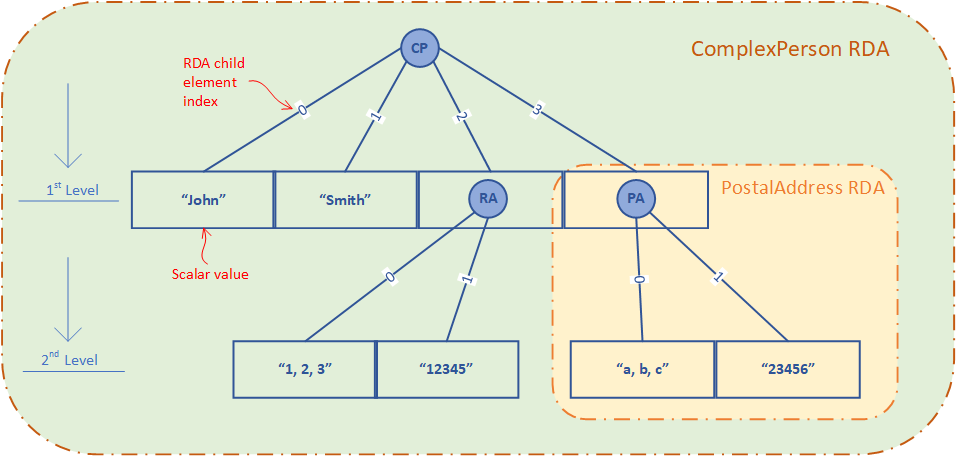

#This artical is under-construction

The following diagram shows an example structure and conent serialized container for an object type of "ComplexPerson" -

With reference to the above diagram, we now explain the following concept and definition - 
* Dimension
* Level
* Scalar value
* RDA Child Element
* RDA Parent Element
* RDA Root Element
